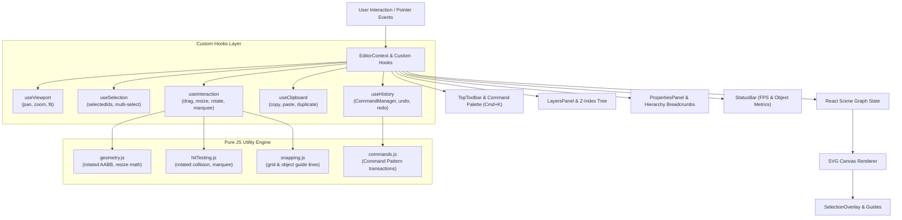

# VectorCraft - Figma-Style Vector Design Tool

🌐 **Live Application Demo**: [https://figmatool.vercel.app/](https://figmatool.vercel.app/)

VectorCraft is an advanced browser-based **Figma-inspired vector design editor** built with React, Vite, Tailwind CSS, and SVG rendering. It features a decoupled scene graph, modular custom hooks architecture, command-based undo/redo history, smart object snapping, nested grouping, inspector breadcrumbs, spotlight command palette, and a 6-suite automated unit test engine.


---

## 🏗️ Architecture & Data Flow



---

## 🌟 Key Features

### 🎨 Canvas & Vector Engine
- **SVG Scene Engine**: High-performance SVG scene graph renderer driven purely by React state.
- **Shape Support**: Rectangles, Circles/Ellipses, Typography Text, and Nested Groups.
- **Double-Click Canvas**: Spawns default shapes near clicked location.

### 📐 Selection & Transformations
- **8 Resize Handles**: Top-Left, Top, Top-Right, Right, Bottom-Right, Bottom, Bottom-Left, Left with handle flipping for negative dimension resizing.
- **Aspect Ratio Constraint**: Hold `Shift` while dragging handles to preserve proportions.
- **Rotation Handle**: Free rotation and `Shift`-snapped 15° increment rotation.
- **Marquee Selection**: Multi-select elements by dragging a selection box across canvas.
- **Keyboard Nudging**: Arrow keys nudge elements by 1px (`Shift + Arrow` nudges by 10px).

### ⚡ Command-Based Undo / Redo
- **Command Pattern**: Implements atomic `execute()`, `undo()`, and `redo()` actions without saving monolithic scene snapshots.
- **Pointerup Transactions**: Dragging, resizing, and rotating create **exactly one** undoable history command when interaction completes.

### 🎯 Snapping & Alignment Engine
- **Grid Snapping**: Snap positions to customizable grid intervals (10px).
- **Smart Object Snapping**: Snap to Left, Right, Center X, Top, Bottom, and Center Y of other visible elements.
- **Visual Alignment Guides**: Dynamic SVG overlay rendering alignment lines.
- **Alignment & Distribution**: Align Left, Center, Right, Top, Middle, Bottom, and Distribute Horizontally / Vertically.

### 📂 Layers & Hierarchy
- **Z-Index Layer Tree**: Visual order reflects rendering z-index.
- **Reordering**: Bring Forward, Send Backward, Bring to Front, Send to Back.
- **Lock & Hide**: Lock elements against accidental movement or toggle visibility.
- **Layer Renaming**: Double-click layer name to rename.
- **Nested Groups**: Group (`Ctrl/Cmd + G`) and Ungroup (`Shift + G`) with recursive scene graph structure.

### 🌟 Portfolio Upgrades
- **Spotlight Command Palette**: Press `Ctrl/Cmd + K` to open search palette with instant hotkey badges.
- **Hierarchy Breadcrumbs**: Visual breadcrumb path in Properties Panel (`Canvas > Group 1 > Rectangle 2`).
- **Real-Time Performance Metrics**: Status bar showing live FPS counter, scene object count, and coordinates.

---

## ⌨️ Keyboard Shortcuts

| Shortcut | Action |
| :--- | :--- |
| `Ctrl/Cmd + K` | Open Command Palette |
| `V` | Select Tool |
| `R` | Rectangle Tool |
| `O` | Circle Tool |
| `T` | Text Tool |
| `H` | Hand (Pan) Tool |
| `Delete` / `Backspace` | Delete selected elements |
| `Arrow Keys` | Nudge selected elements by 1px |
| `Shift + Arrow Keys` | Nudge selected elements by 10px |
| `Ctrl/Cmd + Z` | Undo |
| `Ctrl/Cmd + Shift + Z` / `Ctrl/Cmd + Y` | Redo |
| `Ctrl/Cmd + G` | Group selected elements |
| `Shift + G` / `Ctrl/Cmd + Shift + G` | Ungroup selected group |
| `Ctrl/Cmd + C` | Copy selected elements |
| `Ctrl/Cmd + V` | Paste copied elements |
| `Ctrl/Cmd + D` | Duplicate selected elements |
| `Ctrl/Cmd + S` | Save current project |

---

## 🧪 Testing (6 Dedicated Test Suites)

Run automated Vitest test suite covering geometry, rotated bounding boxes, hit testing, snapping, coordinate transformations, command history, and SVG/JSON export:

```sh
npm test
```

```text
 ✓ src/tests/coordinates.test.js (2 tests)
 ✓ src/tests/export.test.js (3 tests)
 ✓ src/tests/snapping.test.js (3 tests)
 ✓ src/tests/history.test.js (3 tests)
 ✓ src/tests/hitTesting.test.js (6 tests)
 ✓ src/tests/geometry.test.js (7 tests)

 Test Files  6 passed (6)
      Tests  24 passed (24)
```

---

## 🛠️ Development Setup

```sh
# Install dependencies
npm install

# Start local dev server
npm run dev

# Run production build
npm run build
```
